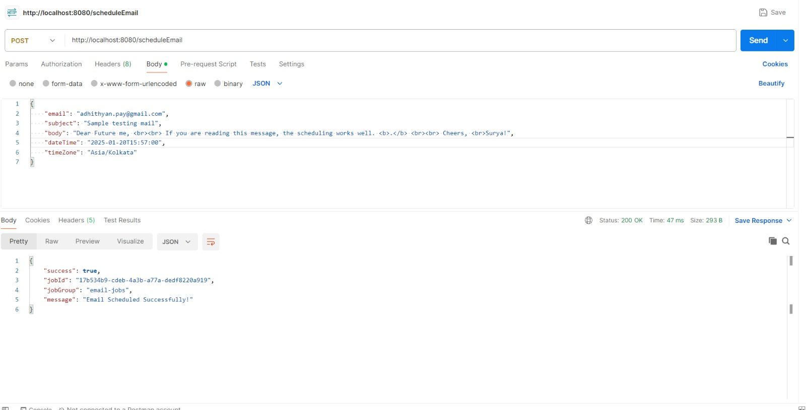

## Requirements

1. Java - 17

2. Maven 

3. MySQL 

## Steps to Setup

**1. Clone the application**

```bash
git clone https://github.com/dArK-sEiD05/Email-scheduling.git
```

**2. Create MySQL database**

```bash
CREATE database quartz_demo;
USE  quartz_demo;
```

**3. Change MySQL username and password as per your MySQL installation**

open `src/main/resources/application.properties`, and change `spring.datasource.username` and `spring.datasource.password` properties as per your mysql installation


**4. Setup Spring Mail**

The project is using Gmail's SMTP server for sending emails. Whether you use Gmail or any other SMTP server, you'll need to configure the following mail properties accordingly -

```properties
spring.mail.host=smtp.gmail.com
spring.mail.port=587
spring.mail.username=Yourmail@gmail.com
spring.mail.password=your mail app password
```

If you're using Gmail, you need to allow the third party apps to send emails by following the instructions below -

+ Go to https://myaccount.google.com/security?pli=1#connectedapps
+ Set ‘Allow less secure apps’ to YES

**5. Create Quartz Tables**

The project stores all the scheduled Jobs in MySQL database. You'll need to create the tables that Quartz uses to store Jobs and other job-related data. Please create Quartz specific tables by executing the `quartz_tables.sql` script located inside `src/main/resources` directory.

```bash
mysql> source <PATH_TO_QUARTZ_TABLES.sql>
```

**6. Build and run the app using maven**

Finally, You can run the app by typing the following command from the root directory of the project -

```bash
mvn spring-boot:run
```

## Scheduling an Email using the /scheduleEmail API

Add a example mail to whom you want to send

```bash
curl -i -H "Content-Type: application/json" -X POST \
-d '{"email":"example@gmail.com","subject":"Testing Schedule,"body":"Dear  me, <br><br> <b>If you are reading this, its working.</b> <br><br> Cheers, <br>Rajeev!","dateTime":"2027-09-04T16:15:00","timeZone":"Asia/Kolkata"}' \
http://localhost:8080/scheduleEmail

# Output
{"success":true,"jobId":"0741eafc-0627-446f-9eaf-26f5d6b29ec2","jobGroup":"email-jobs","message":"Email Scheduled Successfully!"}
```

## OUTPUT 



